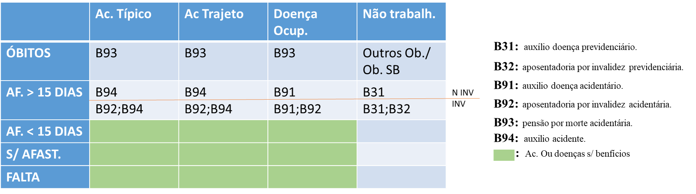

```{r setup, include=FALSE}
knitr::opts_chunk$set(echo = TRUE)
```

# Modelo Matemático - Razão Benefício-Custo
Este documento contém uma definição do modelo matemático que suporta a calculadora de custos e benefícios de inciativas em SST.


## CBR - Razão Benefício-Custo
A razão benefício-custo ${RBC}$ corresponde à razão do somatório dos custos $C_i$ onde $i$ representa o índice de custos e $B_j$ os benefícios a valor presente.

$${RBC} = \frac{\sum_{i=1}^{I} B_{i}} {\sum_{j=1}^{J} C_{j}}$$

### Fluxo de Caixa em Valor Presente
Os fluxos de caixa devem ser ajustados a valor presente utilizando-se uma taxa de atratividade $\theta$ definida pelo usuário do modelo. Tal taxa será utilizada para trazer os valores de fluxo de caixa a valor presente.

$$B_i(t) = \frac{b_i}{(1+\theta)^t}$$

### Cálculo dos Benefícios da Iniciativa
Em todos os casos, o benefício será calculado a partir da diferença em valores monetários de uma variável financeira sem a iniciativa em SST e com a iniciativa em SST. Exemplificando, o benefício gerado pela redução de absenteísmo $B_{abs}$ será calculado a partir da seguinte equação.

$$B_i = {D}_{i, inic} - {D}_{i, asis}$$
Exemplificando, se uma empresa, sem uma iniciativa em SST terá $20000$ reais em desepesas com absenteísmo, e com esta iniciativa terá $15000$, o benefício oriúndo desta inciativa, apenas relacionado a absenteísmo será:

$$B_{abs} = {D}_{abs, inic} - {D}_{abs, asis} = (-15000)-(-20000) = 5000$$

### Cálculo dos Eventos
Em todos os casos, o número de eventos será calculado a partir da multiplicação do número de funcionários da empresa $f$, e o percentual de funcionários $Pev_c$ que sofrerá o evento $c$, e o percentual do tipo de acidente $k$ ocorrer $Pev_{k}$. Os eventos $c$ pertecem ao conjunto $C =\{afastamento<15, afastamento>15, óbito, sem afastamento\}$ e os tipos de acidente $k$ pertencem ao conjunto $K= \{típico, trajeto, doença não ocupacional\}$. 

$$Nev_{c,k}= f * Pev_{k} * Pev_{c} \ \forall \ c \  \in \ C,  \ k \  \in \ K$$

#### Calculo de Faltas
O número de faltas será calculado a partir da multiplicação do número de funcionários da empresa $f$ e a taxa de falta $T_{falta}$, conforme equação abaixo: 

$$N_{falta} = f * T_{falta}$$ 

### Ligação entre Eventos e Variáveis Previdenciárias

O quadro a seguir apresenta a ligação entre os eventos e os benefícios calculados.


#### B91 - Auxílio Doença Acidentário.

Após o calculo dos eventos serão calculados os benefícios gerados a partir deste benefícios.

$$N_{b91} = Nev_{ocupacional, af>15}$$


#### B92 - Aposentadoria por Invalidez Acidentária


O número de benefícios concedidos $N_{b92}$ será igual ao número de afastamentos menor do que quinze dias $Nev_{af_{<15},k}$.


$$N_{b92} = Nev_{af_{>15},k} * P_{inval} , onde \ k = (típico \ , trajeto \  ou \ doença \ ocupacional) $$
A probabilidade de invalidez P_{inval} será igual para cada tipo de acidente $k$.

#### B93 - Pensão por Morte Acidentária

$$N_{b93} = Nev_{obito, k}, onde \ k = (típico \ , trajeto \  ou \ doença \ ocupacional)$$

#### B94 - Auxílio Acidente

$$N_{b94} = (Nev_{af>15},_{traj} + Nev_{af>15},_{tipico})$$
Deve-se notar que, para fins de FAP, os eventos não devem considerar os acidentes de trajetos. Caso o número de benefícios separado por espécie seja apenas relevante para o FAP, os acidentes de trajetos devem ser removidos das fórmulas acima. Caso contrário, devem ser criadas variáveis em separado para fins de FAP e para outros fins.

#### B31 - Auxílio Doença Previdenciário

Os Auxílios por Doença Previdenciário serão calculados a partir dos eventos não relacionados ao trabalho $Nev_{NRelacionadoAoTrabalho, af>15}$.
$$N_{b31} = Nev_{NRelacionadoAoTrabalho, af>15}$$

#### B32 - Aposentadoria Invalidez Previdenciário

As aposentadorias por invalidez previdenciárias serão calculadas a partir dos eventos não relacionados ao trabalho $Nev_{NRelacionadoAoTrabalho, af>15}$.
$$N_{b32} = Nev_{NRelacionadoAoTrabalho, af>15} * P_{Invalidez}$$

#### Numero de benefícios acumulados 

O número de benefícios acumulado será calculado de acordo com o número de benefícios concedido até o período $t$ em questão e o número de benefícios inicial.
$$NB_{i,t} = \sum_{t=1}^{t} N_i,t + N_i,inicial \ \forall \ i \  \in \ B$$

### Categorias de Benefícios


#### Despesas Evitáveis


##### Despesas com Reclamatórias Trabalhistas
Esta subcategoria compreende as despesas evitadas com reclamatórias trabalhistas (objeto da ação relacionadas à doenças e acidentes do trabalho) após a implementação integral da iniciativa.

$${D}_{reclamatorias} = c_{medrec}*n_{reclamatorias} $$

###### Número de Reclamatórias Trabalhistas

O número de reclamatórias trabalhistas será calculado considerando o número de funcionários desligados total multiplicado pela probabilidade de ajuizar e ganhar uma reclamatória trabalhista.
$$n_{reclamatorias} = f_{desligados} * p_{ajuizarEganharreclamatoria} $$


##### Acidente / Doença Ocupacional - Invalidez

Esta subcategoria compreende as despesas evitadas com incapacitação parcial ou total provocada por acidente típico, doença ocupacional ou acidente de trajeto após a implementação integral da iniciativa.

Possibilidade 1: Todos os custos incorridos nesta rúbrica entram para o calculo do FAP e não deveriam ser contados em duplicidade.
Possibilidade 2: Existem despesas que não estão em nenhuma outra categoria e que deveriam ser contabilizados aqui. A princípio estamos na possibilidade 1. A categoria será excluída caso a possibilidade 1 se confirme.

##### Ações Regressivas
Esta subcategoria compreende as despesas evitadas com ações regressivas do INSS após a implementação integral da iniciativa. A Ação Regressiva representa o o ressarcimento de pagamento de benefícios acidentários do empregador ao INSS. Lei 8213/91, artigo 120 :A ação regressiva é a penalização adicional relacionada ao B91 - B94.

###### Ações Regressivas Relacionadas ao INSS

As despesas com ações regressivas relacionadas ao INSS serão calculadas considerando o número de benefícios acumulado, e a probabilidade de incidência de uma ação regressiva, e a despesa média relacionada a uma ação regressiva. Além disso, um cenário de crise poderá modular a esta função.
$$D_{ações regressivas INSS} =  \sum_{i=1}^{B} nacumulado_i * p_{acaoregress} * (f_{crise}*crise) * tregress_{i}  $$

###### Ações Regressivas Relacionadas ao Plano de Saúde

As despesas com ações regressivas relacionadas ao plano de saúde serão calculadas de forma similar, considerando os afastamentos acumulados, o percentual de tratamento no SUS e no Plano de Saúde e o custo médio do evento no plano de saúde.
$$D_{açõesregrSUS} =  AfastamenAcumulad * PercTratSus * (f_{crise}*crise) * PercCobrSUSEPlano * cmed$$

##### Ausência para Tratamento

Esta subcategoria compreende as despesas evitadas com a ausência do trabalhador afastado para tratamento após a implementação integral da iniciativa. Os custos desta categoria já estão incluidos na categoria de absenteísmo.

##### Despesas Médicas

Esta subcategoria compreende as despesas evitadas com medicamento e atendimento médico para tratamento dos acidentes de trabalho após a implementação integral da iniciativa.

$$D_{medicas} = (\sum_{k=1}^{K} n_{acidentesk}) * d_{medio}$$

##### Redução de Valores do plano de Saúde 
Esta subcategoria compreende as despesas evitadas com planos de saúde via alteração da taxa de sinistralidade após a implementação integral da iniciativa. A despesa com o plano de saúde de cada período será calculada de acordo com a despesa do ano anterior, acrescida de um percentual de reajuste estimado.

$$D_{planosaude,t} = D_{planosaude,t-1} * (1 + Reaj_{estimado,t})$$

O reajuste estimado será obtido por meio de uma regressão, comparada ao número de acidentes total $\sum_{k=1}^{K} {\sum_{c=1}^{C} {n_{acidentes \ k,c}}}$, considerando a soma de acidentes do ano anterior. Deve-se observar que o intercepto $B_0$ e o coeficiente $B_1$ serão estimados a priori, e aplicados pelo modelo a cada ano.

$$Reaj_{estimado,t} = \beta_{0,reaj} +\beta_{1,reaj} * \sum_{k=1}^{K} {\sum_{c=1}^{C} {n_{acidentes \ k,c, t-1}}}$$

##### Interrupção Operacional por Acidente/Morte

As despesas com interrupção operacional serão calculadas considerando o número de acidentes típicos, o tempo médio de interrução e o lucro cessante médio diário oriúndo de cada acidente.
$$D_{interdicao} = n_{acidentestipico} * dias_{interr,acidente} * lucrocessante$$

##### Interdições Por Fiscalização
As despesas com interdições por fiscalização serão calculadas de acordo com a probabilidade de interdição, o número médio de dias relacionados à interdição por fiscalização e o lucro cessante médio diário oriúndo de cada interdição. Adicionalmente, esta equação pode ser modulada pela projeção de uma crise financeira.
$$D_{interdicao} = p_{interdicao} * (f_{crise}*crise) * dias_{interr,fiscalizacao} * lucrocessante $$

##### Reabilitaçãodo Trabalhador

Trabalhadores passíveis de esforços de reabilitação incluem trabalhadores préviamente afastados (seja por mais do que 30 dias ou por mais do que 15 dias), e PCD's.
$$D_{reab} = custo_{reab} * ((Nev_{c, af>15} + Nev_{c, af<15}) * preab + N_{PCDs}) $$

#### Reduções Fiscais

##### Exposição à Multas

As despesas oriúndas da exposição à multa serão calculadas considerando-se o número de multas aplicadas e o custo médio da multa. Adicionalmente, o número de multas também pode ser modulado pela ocorrência de uma crise.
$$D_{multas}= (f_{crise}*crise) * N_l * C_{med_l}$$

###### Número de multas
O número de múltas aplicado será calculado de acordo com o atingimento da legislação (variável binária 0 ou 1) e a probabilidade de multa dado que não haja atendimento completo à legislação.
$$N_l = Atendlegisl_l * p_{multa_l}$$

###### Probabilidade de multa
A probabilidade de multa será modulada a partir de uma probabilidade de multa a priori, e de acordo com os eventos de acidentes típicos e doenças ocupacionais. Cada acidente ocorrido aumentará a probabilidade de multa nas unidades definidas em $fator_{l}$.
$$ p_{multa_l} =  p_{multapriori_l} + fator_{l} * (Nev_{tipico} + Nev_{doenocup})$$

##### FAP

Fonte para o calculo do FAP utilizada: <http://sislex.previdencia.gov.br/paginas/72/MF-CNP/2017/1329.htm>

###### Índices de Frequência, Gravidade e Custo

Os óbitos sem benefício são exatamente isso: Óbitos acidentários que não receberam benefício (por algum motivo).

$$I_f = \frac{(n_{obitossembeneficio}+n_{b92}+n_{b91}+n_{b93}+n_{b94})}{f} * 1000$$

Para fins de calculo do FAP, o índice de frequência deve considerar os dois últimos anos.

$$I_f,t = \frac{I_{f,t-1} + I_{f,t-2}}{2}$$

O índice de gravidade será calculado a partir desta fórmula:

$$I_g = \frac{(0.1*n_{b91}+0.3*n_{b92}+0.5*(n_{b93}+n_{obitossembeneficio})+0.1*n_{b94})}{f}* 1000$$

E o índice de custo será calculado a partir desta fórmula:

$$I_c = \frac{\sum_{i=91}^{94} n_{i}*cmed_{i}}{folhamédia} * 1000$$

###### Percentis
Percentis são calculados de acordo com os índices nos dois anos anteriores.Os percentis dependem do posicionamento da empresa em relação às demais. Específicamente a função $Pos(I_{t})$ é calculada pela previdência de acordo com os índices de todas as empresas no mesmo subgrupo do CNAE da empresa em questão.

$$p_t = \frac{100*(Pos(I_{t})-1)}{n-1}$$

Considerando a necessidade de estimar o percentil a partir dos eventos, será utilizada uma regressão linear relacionando o percentil ao número de eventos observados na empresa. Considerando que o FAP é calculado utilizando os últimos dois anos, a regressão também deve considerar este mesmo período.

$$p_t = \beta_{0,percent} + \beta_{1,percent} * \sum_{k=1}^{K} {\sum_{c=1}^{C} {n_{acidentes \ k,c, t-1, t-2}}}$$


###### Índice Composto

O IC, por sua vez, é calculado de acordo com os percentis de gravidade $p_g$, frequência $p_{f}$ e custo$p_c$:

$$IC = (0,5*p_g + 0,35*p_{f}+0,15*p_c)0,02$$

###### Calculo Final do FAP

Para o Calculo do FAP, o turnover da empresa deve ser calculado considerando os ultimos dois anos. Deve ser observado o item 3.8, que indica que " Serão consideradas no cálculo apenas as rescisões sem justa causa, por iniciativa do empregador, inclusive rescisão antecipada do contrato a termo; e as rescisões por término do contrato a termo."

$$turnover_{FAP} = \frac{\frac{min(admissoes_{t-1}, recisoes{t-1})}{f_{t-1}} + \frac{min(admissoes_{t-2}, recisoes_{t-2})}{f_{t-2}}}{2}$$

Ajuste 1 - Aplicado para os casos onde o IC < 1, de modo que o FAP será no mínimo 0,5.
$$FAP = 0,5 + 0,5 * IC \ if \ (IC < 1, turnover_{FAP} < 0,75) $$

Ajuste 2 - aplicado para os casos onde a empresa obteve turnover maior do que 0,75.

$$FAP = 1 \ if \ IC < 1, (turnover_{FAP} > 0,75)$$

Ajuste 3 - aplicado para os casos onde a empresa pode receber um desconto (bônus) de 0,15 em seu FAP.

$$FAP = IC - (IC-1)*0,15 \ \ if \ (IC > 1, n_{b92,t-2}+n_{b93t-2} = 0)$$

Ajuste 4 - aplicado para o caso onde a empresa não pode obter o desconto (bônus) de 0,15.

$$FAP = IC  \ if \ (IC > 1, n_{b92,t-2}+n_{b93t-2} > 0) $$
Ajuste 5 - Se a empresa tem menos do que dois anos, o FAP será igual a 1

$$FAP = 1  \ if \ (T_{idadeempresa} <= 2) $$

###### RAT Ajustado

O $RAT$ varia entre 1 e 3, de acordo com o cnae da empresa em questão.
$$RAT \in \{1,2,3\}$$

$$RAT_{ajust} = (FAP * RAT)$$

As despesas com seguro acidentário do trabalho $D_{sat}$ serão calculadas de acordo com as estimativas do $FAP$ ($0,005 - 0,02$) e $RAT$ . Observar que o RAT ajustado calculado em um determinado ano será usado no ano seguinte para o calculo da despesa.

$$D_{sat} = RAT_{ajust,t-1}* F$$
Exemplo:
Período Base de cálculo: 2014 e 2015. Cálculo do FAP: 2016. Vigência: 2017.

#### Intangível

##### Imagem da Empresa

Os benefícios da inciativa relacionados à imagem foram desmembradas em duas variáveis. Uma variável considera o ganho obtido com expansão de receita, e uma segunda apresenta o ganho relacionado às despesas com contratação. A variável  $D_{imagem, receita}$ será informada como dado de entrada, considerando-se sua especificidade relacionada à inciativa.

$$D_{imagem}  = D_{imagem, contratacao} + D_{imagem, receita}$$

As despesas com imagem relacionadas a contratação serão estimadas considerando o tempo de contratação médio, custo de contratação e número médio de funcionários contratados.
$$D_{imagem, contratacao} = t_{contrat} * custo_{contrat} * n_{contrat}$$

A variável de tempo de contratação será estimada por meio de uma regressão linear, considerando o número de eventos do ano anterior (considerando acidentes com afastamento maior do que 15 dias e óbitos).

$$t_{contrat} = \beta_{0,tcontrat} + \beta_{1,tcontrat} * \sum_{k=1}^{K} {\sum_{c=1}^{C} {n_{acidentes \ k,c, t-1}}}$$

##### Engajamento e Clima organizacional (a discutir)

As despesas relacionadas a engajamento e clima organizacional serão calculadas a partir de desligamentos voluntários, projetados.

$$D_{clima} = Des_{voluntarios} * c_{sub}$$ 

A variável de desligamento voluntário será calculada por meio de uma regressão linear, considerando os eventos calculados.

$$Des_{voluntarios} = \beta_{0,desvolunt} + \beta_{1,desvolunt} * \sum_{k=1}^{K} {\sum_{c=1}^{C} {n_{acidentes \ k,c, t-1}}} $$

#### Melhor Uso dos Recursos

##### Turnover

As despesas com Turnover $D_{tur}$ serão calculadas com base no número de funcionários afastados por problemas relacionados à SST $n_{afast}$ e no custo médio de substituição dos funcionários$c_{sub}$.

$$D_{tur} = (Nev_{af_{>15},k} + Nev_{obito,k}) * c_{sub}$$ 

##### Absenteísmo

As despesas com Absenteísmo $D_{abs}$ serão calculadas com base no número de dias de absenteísmo por problemas relacionados à SST $d_{abs}$, no número de horas trabalhadas por dia $h$ e no custo em mão de obra médio horário $c_{mdo}$.

$$D_{abs} = d_{abs} * h * c_{mdo}$$

###### Dias de Absenteísmo

Os dias de absenteísmo levam em consideração os afastamentos menores do que 15 dias $Nev_{af<15,k}$ e as faltas.

$$ d_{abs} = Nev_{af<15,k} * D_{medioafast<15} + Nfalta$$

##### Presenteísmo

Assim como o absenteísmo, o presenteísmo será calculado considerando o custo médio da mão de obra, o número de horas trabalhadas e o índice de presenteísmo. O índice será informado para a situação com iniciativa e sem iniciativa.

$$D_{presenteismo} = Perc_{present} * f * h * c_{mdo}$$

##### Refugo e Retrabalho

As despesas com refugo e retrabalho serão calculadas considerando o número de eventos típicos e doenças ocupacionais, e um custo médio em refugo e retrabalho por evento.

$$D_{refug_retr} = cmed_{refretr} * Nev_{tipico,ocupac}$$

##### MP, Insumos, Equipamentos Operação
De modo similar, as despesas com matéria prima, insumos e equipamentos serão calculadas considerando o número de eventos típicos e doenças ocupacionais, e um custo médio por evento.

$$D_{MP,Ins,Eq} = cmed_{MP,Ins,Eq} * Nev_{tipico,ocupac}$$

##### Qualidade

Os ganhos em qualidade $D_{qual,t}$ serão calculados considerando os savings médios unitários em qualidade $sav_{qual}$projetados pela iniciativa, multiplicados pela produção projetada do período.

$$D_{qual,t} = sav_{qual} * prod_{proj,t}$$

##### Produtividade

Os ganhos em produtividade $D_{prod,t}$ serão calculados considerando os savings médios unitários em mão-de-obra $sav_{MDO}$projetados pela iniciativa, multiplicados pela produção projetada do período.
$$D_{prod,t} = sav_{MDO} * prod_{proj,t}$$
